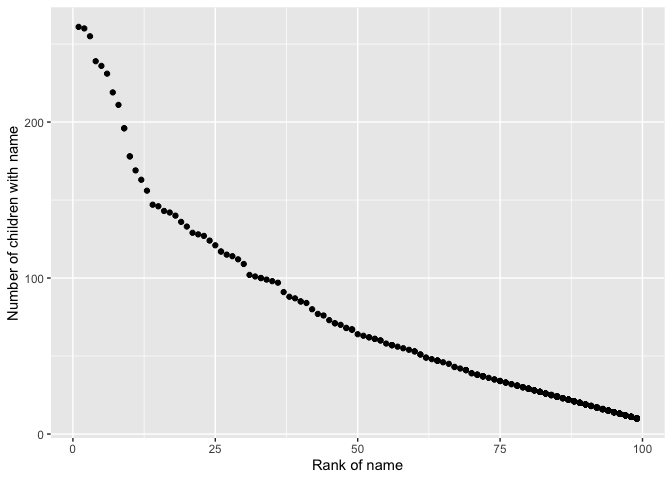

Homework 2
================
Jessica Lavery
9/27/2019

# Problem 1

Mr. Trash Wheel dataset

``` r
# read in Mr. Trash Wheel dataset
trash_wheel <- read_excel("./data/HealthyHarborWaterWheelTotals2018-7-28.xlsx", 
                          sheet = "Mr. Trash Wheel",
                          range = "A2:N336") %>% 
  janitor::clean_names() %>% 
  drop_na(dumpster) %>% 
  mutate(sports_balls_int = as.integer(round(sports_balls, 1)))

# check the above
# class(pull(trash_wheel, sports_balls_int))
```

Precipitation data, 2017-2018

``` r
# read in 2017 precipitation data
precip_2017 <- read_excel("./data/HealthyHarborWaterWheelTotals2018-7-28.xlsx", 
                          sheet = "2017 Precipitation",
                          range = "A2:B14") %>% 
  janitor::clean_names() %>% 
  drop_na(total) %>% 
  rename(precip = total) %>% 
  mutate(year = 2017)

# read in 2018 precipitation data
precip_2018 <- read_excel("./data/HealthyHarborWaterWheelTotals2018-7-28.xlsx", 
                          sheet = "2018 Precipitation",
                          range = "A2:B14") %>% 
  janitor::clean_names() %>% 
  drop_na(total) %>% 
  rename(precip = total) %>% 
  mutate(year = 2018)

# combine the precipitation datasets 
precip_2017_2018 <- bind_rows(precip_2017, precip_2018) %>% 
  mutate(month = month.name[month])
```

The trash wheel dataset records trash found in the Harbor by month and
year, from 2014-05-16 through 2018-07-28. The amount of trash is
recorded in terms of weight, volume, as well as by type of trash:
plastic bottles, polystyrene, cigarette butts, glass bottles, grocery
bags, chip bags, and sports balls. The total amount of trash over the
study period was 934.94 tons, or 4439 cubic yards. The median number of
sports balls in a dumpster in 2017 was 8.

The precipitation datasets record the amount of precipitation by month
and year. Precipitation data was recorded for 12 months in 2017 and 7
months in 2018. The average precipitaiton among months recorded across
both years was 2.97 inches (standard deviation 2.5), ranging from 0 to
9.27. The total precipitation was 32.93 in 2017 and 3.3571429 in 2018.

# Problem 2

``` r
# read in and clean pols-month data
pols <- read_csv("./data/pols-month.csv") %>% 
  separate(col = mon, into = c("year", "month", "day"), sep = '-') %>% 
  mutate(month = month.abb[as.numeric(month)],
         year = as.numeric(year), 
         president = case_when(
           prez_gop == 1 ~ "gop",
           prez_dem == 1 ~ "dem"
         )) %>% 
  select(-prez_gop, -prez_dem, -day)
```

    ## Parsed with column specification:
    ## cols(
    ##   mon = col_date(format = ""),
    ##   prez_gop = col_double(),
    ##   gov_gop = col_double(),
    ##   sen_gop = col_double(),
    ##   rep_gop = col_double(),
    ##   prez_dem = col_double(),
    ##   gov_dem = col_double(),
    ##   sen_dem = col_double(),
    ##   rep_dem = col_double()
    ## )

``` r
pols
```

    ## # A tibble: 822 x 9
    ##     year month gov_gop sen_gop rep_gop gov_dem sen_dem rep_dem president
    ##    <dbl> <chr>   <dbl>   <dbl>   <dbl>   <dbl>   <dbl>   <dbl> <chr>    
    ##  1  1947 Jan        23      51     253      23      45     198 dem      
    ##  2  1947 Feb        23      51     253      23      45     198 dem      
    ##  3  1947 Mar        23      51     253      23      45     198 dem      
    ##  4  1947 Apr        23      51     253      23      45     198 dem      
    ##  5  1947 May        23      51     253      23      45     198 dem      
    ##  6  1947 Jun        23      51     253      23      45     198 dem      
    ##  7  1947 Jul        23      51     253      23      45     198 dem      
    ##  8  1947 Aug        23      51     253      23      45     198 dem      
    ##  9  1947 Sep        23      51     253      23      45     198 dem      
    ## 10  1947 Oct        23      51     253      23      45     198 dem      
    ## # … with 812 more rows

``` r
# read in and clean snp data
snp <- read_csv("./data/snp.csv") %>% 
  separate(col = date, into = c("month", "day", "year"), sep = '/') %>% 
  arrange(year, as.numeric(month)) %>% 
  mutate(month = month.abb[as.numeric(month)],
         year = as.numeric(year)) %>% 
  select(year, month, close)
```

    ## Parsed with column specification:
    ## cols(
    ##   date = col_character(),
    ##   close = col_double()
    ## )

``` r
snp
```

    ## # A tibble: 787 x 3
    ##     year month close
    ##    <dbl> <chr> <dbl>
    ##  1  1950 Jan    17.0
    ##  2  1950 Feb    17.2
    ##  3  1950 Mar    17.3
    ##  4  1950 Apr    18.0
    ##  5  1950 May    18.8
    ##  6  1950 Jun    17.7
    ##  7  1950 Jul    17.8
    ##  8  1950 Aug    18.4
    ##  9  1950 Sep    19.5
    ## 10  1950 Oct    19.5
    ## # … with 777 more rows

``` r
# read in and tidy unemployment data
unemp <- read_csv("./data/unemployment.csv") %>% 
  janitor::clean_names() %>% 
  pivot_longer(cols = jan:dec,
               names_to = "month",
               values_to = "unemp_rate") %>% 
  mutate(month = str_to_sentence(month))
```

    ## Parsed with column specification:
    ## cols(
    ##   Year = col_double(),
    ##   Jan = col_double(),
    ##   Feb = col_double(),
    ##   Mar = col_double(),
    ##   Apr = col_double(),
    ##   May = col_double(),
    ##   Jun = col_double(),
    ##   Jul = col_double(),
    ##   Aug = col_double(),
    ##   Sep = col_double(),
    ##   Oct = col_double(),
    ##   Nov = col_double(),
    ##   Dec = col_double()
    ## )

``` r
unemp
```

    ## # A tibble: 816 x 3
    ##     year month unemp_rate
    ##    <dbl> <chr>      <dbl>
    ##  1  1948 Jan          3.4
    ##  2  1948 Feb          3.8
    ##  3  1948 Mar          4  
    ##  4  1948 Apr          3.9
    ##  5  1948 May          3.5
    ##  6  1948 Jun          3.6
    ##  7  1948 Jul          3.6
    ##  8  1948 Aug          3.9
    ##  9  1948 Sep          3.8
    ## 10  1948 Oct          3.7
    ## # … with 806 more rows

``` r
# merge snp and pols
pols_snp <- inner_join(pols, snp, by = c("year", "month"))

pols_snp_unemp <- inner_join(pols_snp, unemp, by = c("year", "month"))
```

The pols dataset contains information about the number of national
politicians in each of the two primary parties (democratic, republican)
by month and year (1947 - 2015). The second data source in problem two
(snp) contains the closing Standard and Poor’s (S\&P) stock market index
on the first of the month between 1950 and 2015. The third dataset of
interest (unemp) contains the percentage of unemployment by month from
1948 through 2015.

Combining these datasets among years and months that all information is
provided (political information, S\&P index, and unemployment), we have
data for 1950 - 2015. Key information contained in the combined dataset
is stored in the variables gov\_gop, sen\_gop, rep\_gop, gov\_dem,
sen\_dem, rep\_dem, president (political), close (S\&P index at market
close), and unemp\_rate (unemployment).

Over this time period, there were 354 months with a democratic president
and 427 months with a republican president. Under democratic presidents,
the S\&P closing index ranged from 17.05 to 2107.39 and unemployment
ranged from 2.7% to 10%. Whereas under republican presidents, the S\&P
closing index ranged from 23.32 to 1549.38 and unemployment ranged from
2.5% to 10.8%.

# Problem 3

``` r
# read in and clean popular baby names data, removing duplicate rows
baby_names <- read_csv("./data/Popular_Baby_Names.csv") %>%
  janitor::clean_names() %>% 
  mutate(gender = str_to_sentence(gender),
         ethnicity = str_to_title(ethnicity),
         childs_first_name = str_to_sentence(childs_first_name),
         ethnicity = recode(ethnicity, 
                            "White Non Hisp" = "White Non Hispanic",
                            "Black Non Hisp" = "Black Non Hispanic",
                            "Asian And Paci" = "Asian And Pacific Islander")) %>% 
  distinct() %>% 
  arrange(year_of_birth)
```

    ## Parsed with column specification:
    ## cols(
    ##   `Year of Birth` = col_double(),
    ##   Gender = col_character(),
    ##   Ethnicity = col_character(),
    ##   `Child's First Name` = col_character(),
    ##   Count = col_double(),
    ##   Rank = col_double()
    ## )

The below table shows the rank of the name Olivia by year and ethnicity.

``` r
# table of popularity (rank) of the name Olivia by year
olivia <- baby_names %>% 
  filter(childs_first_name == "Olivia") %>% 
  select(-gender, -childs_first_name, -count) %>% 
  pivot_wider(names_from = year_of_birth,
              values_from = rank)

olivia %>% kable()
```

<table>

<thead>

<tr>

<th style="text-align:left;">

ethnicity

</th>

<th style="text-align:right;">

2011

</th>

<th style="text-align:right;">

2012

</th>

<th style="text-align:right;">

2013

</th>

<th style="text-align:right;">

2014

</th>

<th style="text-align:right;">

2015

</th>

<th style="text-align:right;">

2016

</th>

</tr>

</thead>

<tbody>

<tr>

<td style="text-align:left;">

Asian And Pacific Islander

</td>

<td style="text-align:right;">

4

</td>

<td style="text-align:right;">

3

</td>

<td style="text-align:right;">

3

</td>

<td style="text-align:right;">

1

</td>

<td style="text-align:right;">

1

</td>

<td style="text-align:right;">

1

</td>

</tr>

<tr>

<td style="text-align:left;">

Black Non Hispanic

</td>

<td style="text-align:right;">

10

</td>

<td style="text-align:right;">

8

</td>

<td style="text-align:right;">

6

</td>

<td style="text-align:right;">

8

</td>

<td style="text-align:right;">

4

</td>

<td style="text-align:right;">

8

</td>

</tr>

<tr>

<td style="text-align:left;">

Hispanic

</td>

<td style="text-align:right;">

18

</td>

<td style="text-align:right;">

22

</td>

<td style="text-align:right;">

22

</td>

<td style="text-align:right;">

16

</td>

<td style="text-align:right;">

16

</td>

<td style="text-align:right;">

13

</td>

</tr>

<tr>

<td style="text-align:left;">

White Non Hispanic

</td>

<td style="text-align:right;">

2

</td>

<td style="text-align:right;">

4

</td>

<td style="text-align:right;">

1

</td>

<td style="text-align:right;">

1

</td>

<td style="text-align:right;">

1

</td>

<td style="text-align:right;">

1

</td>

</tr>

</tbody>

</table>

The below table shows the most popular baby name among male children by
year and ethnicity.

``` r
# most popular name among male children over time
popular_male <- baby_names %>% 
  filter(rank == 1, gender == "Male") %>% 
  select(-gender, -count, -rank) %>% 
  pivot_wider(names_from = year_of_birth,
              values_from = childs_first_name)

popular_male %>% kable()
```

<table>

<thead>

<tr>

<th style="text-align:left;">

ethnicity

</th>

<th style="text-align:left;">

2011

</th>

<th style="text-align:left;">

2012

</th>

<th style="text-align:left;">

2013

</th>

<th style="text-align:left;">

2014

</th>

<th style="text-align:left;">

2015

</th>

<th style="text-align:left;">

2016

</th>

</tr>

</thead>

<tbody>

<tr>

<td style="text-align:left;">

Asian And Pacific Islander

</td>

<td style="text-align:left;">

Ethan

</td>

<td style="text-align:left;">

Ryan

</td>

<td style="text-align:left;">

Jayden

</td>

<td style="text-align:left;">

Jayden

</td>

<td style="text-align:left;">

Jayden

</td>

<td style="text-align:left;">

Ethan

</td>

</tr>

<tr>

<td style="text-align:left;">

Black Non Hispanic

</td>

<td style="text-align:left;">

Jayden

</td>

<td style="text-align:left;">

Jayden

</td>

<td style="text-align:left;">

Ethan

</td>

<td style="text-align:left;">

Ethan

</td>

<td style="text-align:left;">

Noah

</td>

<td style="text-align:left;">

Noah

</td>

</tr>

<tr>

<td style="text-align:left;">

Hispanic

</td>

<td style="text-align:left;">

Jayden

</td>

<td style="text-align:left;">

Jayden

</td>

<td style="text-align:left;">

Jayden

</td>

<td style="text-align:left;">

Liam

</td>

<td style="text-align:left;">

Liam

</td>

<td style="text-align:left;">

Liam

</td>

</tr>

<tr>

<td style="text-align:left;">

White Non Hispanic

</td>

<td style="text-align:left;">

Michael

</td>

<td style="text-align:left;">

Joseph

</td>

<td style="text-align:left;">

David

</td>

<td style="text-align:left;">

Joseph

</td>

<td style="text-align:left;">

David

</td>

<td style="text-align:left;">

Joseph

</td>

</tr>

</tbody>

</table>

The following scatterplot shows the number of male, white non-hispanic
children born in 2016 with a given name against the rank in popularity
in that name.

``` r
# male, white non-hispanic children born in 2016
male_white_2016 <- baby_names %>% 
  filter(year_of_birth == 2016, gender == "Male", ethnicity == "White Non Hispanic")

ggplot(data = male_white_2016, aes(x = rank, y = count)) +
  geom_point() + 
  xlab("Rank of name") +
  ylab("Number of children with name")
```

<!-- -->
